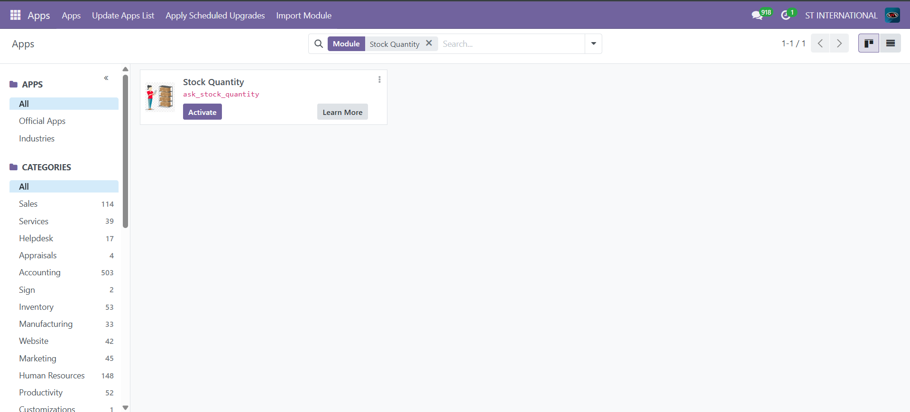
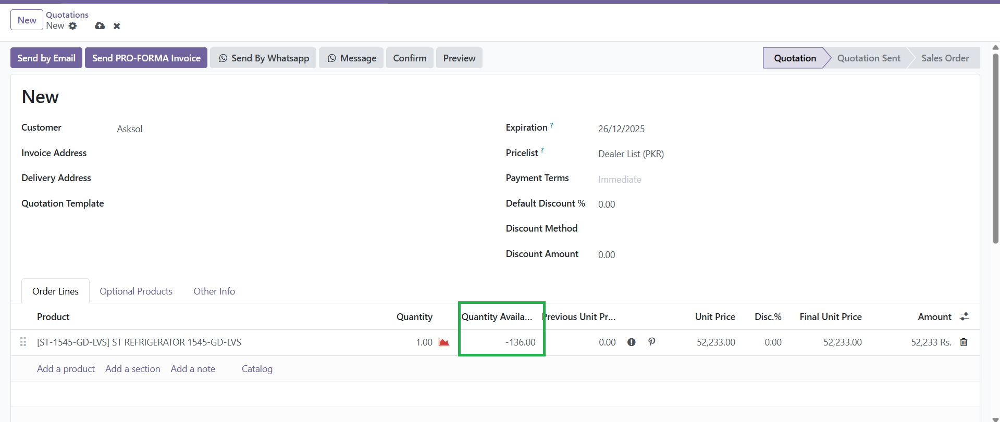

# Stock Quantity

## Overview
**Stock Quantity** is an Odoo 18 module that displays the available stock quantity directly in sale order lines for quick reference during order creation/editing.

### Features
- Adds `qty_available` field to Sale Order Lines (related to product's `qty_available`).
- Real-time, read-only display – no manual updates needed.
- Compatible with Odoo Sale and Stock modules.
- Clean integration via view extension.

## Requirements
- Odoo 18.0
- Dependencies: `sale`, `stock`, `sale_management`

## Installation
1. Copy the `ask_stock_quantity` folder to your Odoo addons directory.
2. Restart Odoo server.
3. Update the Apps list (Apps > Update Apps List).
4. Search for "Stock Quantity" and install it.

## Usage
1. Go to **Sales > Orders > Sales Orders**.
2. Create/Edit a sales order.
3. Add products to order lines – see **Quantity Available** column showing current stock qty.

## Screenshots

## Demo
Contact [Asksol](https://www.asksol.pk) for demo instance.

## Changelog
- 18.0.0.1: Initial release.

## Support & License
- Author: Asksol (https://www.asksol.pk)
- License: LGPL-3
- Repository: This directory.

---

*Module tested on Odoo 18 Community.*

